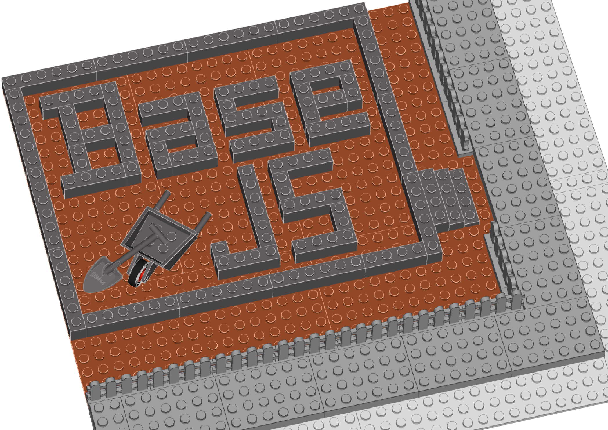

**Framework Base.JS** is a simple base for your project. It's simple, fast, focused and fully modular. As everybody has a different needs, we do not plan to include a lot of specialized features in the framework itself. Custom features can be installed as npm packages or added as a file into one of the libs, services or utils directories. Thanks to the included project bootstrap and a script for automatically creating index files, you're free to focus on the business logic and design side of your project (src/). With the client components, you can break up your site into a bunch of small recyclable, separate pieces, which communicate using events by default.
  
The client side looks like a Node.js application, which allows for any IDE autocomplete functionality. All framework functions are fully documented and allow for an optional type definitions. Every directory contains an `_example.js` file with working sample code.
  
The first run generates/updates a configuration file `jsconfig.json`, which allows you to configure the framework behavior and its services/utils functions. The `package.json` file is also updated with required dependencies and the `start` and `indexing` scripts.  
  
**ALERT:** Framework does not and will not support outdated browsers.
  
# Download and Installation
```
git clone git@github.com:ObscurusGrassator/Base.JS.git you_project_name
cd you_project_name
NODE_PATH=. node manager.js
```
  
# Start
```
npm start
```
  
# Update
```
git --git-dir=.gitBase.JS pull
```

# Uninstallation
Simply delete the whole directory
  
  
# Client loading order

First, functions and classes from the utils, services and src directories are initialized.
Next, functions wrapped in `window.afterLoadRequires.unshift(() => { ... });` are called.
At last, the business logic in `window.addEventListener('load', () => { ... });` is run.  
  
**WARNING:** Client code in utils/services/src should be wrapped in a function or via `window.afterLoadRequires.unshift(() => { ... });` so it is run only when all dependencies are loaded.
For example in the case of shared functions:
```
let wrapper = () => { ... };
// @ts-ignore
if (typeof require === 'undefined') window.afterLoadRequires.unshift(wrapper); else wrapper();
```
  
# File structure

All framework files have a `.base` suffix.
All `index.js` files are automatically generated by the framework. These files index all `.js` files in the directories defined in jsconfig.json > utils._createIndex except files prefixed with `.ignr`.
Other framework generated files are suffixed with `.gen`.
  
```
.gitBase.JS/               // renamed framework .git folder
.github/                   // contain README.md and license.txt
manager.js                 // start project (call server.js)
server.js                  // start server (call your_app.js)
jsconfig.json              // project configuration
jsconfig.local.json        // local project configuration changes compared to jsconfig.js
client/
   services/
      event.base.js                    // communication of components through events
   utils/
      browserTestCompatibility.base.js // page is not shown for old/incompatible browsers
      getActualElement.ignr.base.js    // get parent DOM element in/of actual template
      templateEditor.base.js           // manual generation dynamic contents
   types/
      events/              // types definition for effective work with events
      storage/             // types definition for effective work with
                           //   saveing/sharing variables/objects
      contentType.js       // types definition for effective work with
                           //   content send from server for client
   src/
   libs/                   // downloaded libraries. e.g.: jquery, lodash
   templates/              // one sandbox .html tmplate must have equal file name as
                           //   possible .js a .css extended files
   css/                    // global styles
server/
   _index.js
   services/
   utils/
      getFilePaths.base.js             // deep file list of folder
      getRealTemplatePath.base.js      // '/_example_/98765' ==> '/article/<id>'
      htmlGenerator.base.js            // creating one client html file
      indexCreate.base.js              // creating index.js of all folder files
   types/
      storage/             // types definition for effective work with
                           //   saveing/sharing variables/objects
   src/
shared/
   services/
      jsconfig.base.js     // default updating and JS access to project configuration
      storage.base.js      // saveing/sharing variables/objects
      testing.base.js      // testing biznis logic
   utils/
```

### shared/utils/
```
   console.base.js            // configure: color, log file
   error.base.js              // better error message

   get.base.js                // (lodash) safely getting of object property
   set.base.js                // (lodash) safely setting of object property
   merge.base.js              // (lodash) objects merge
   defaults.base.js           // (lodash) objects merge
   substring.base.js          // (PHP) implementing negative value 
   contain.base.js            // check if object A conains object B

   jsonStringify.base.js      // prettyer JSON.stringifi
   promisify.base.js          // transform function with callback to promise
   urlParser.base.js          // extended new URL()
```

[Code screenshots here](http://obsgrass.com/public/Base.JS_screenshots)  

The image was modeled in [Bricksmith 3.0](http://bricksmith.sourceforge.net)  

Contact: obscurus.grassator@gmail.com  

[MIT License](https://choosealicense.com/licenses/mit/) - [Copyright (c) 2019 Obscurus Grassator](./license.txt)  
